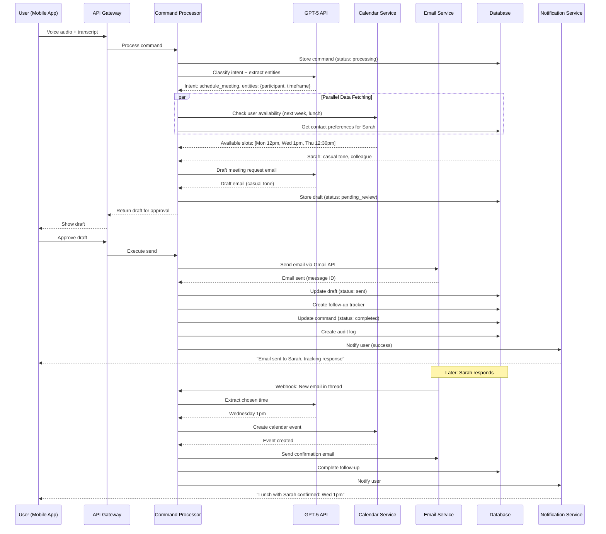
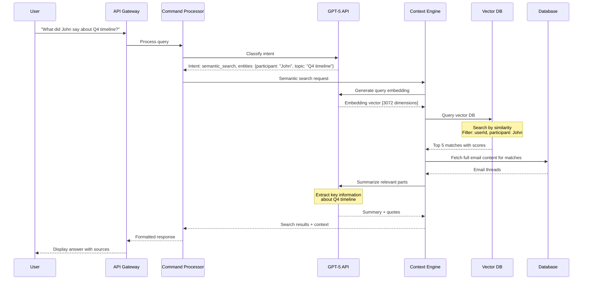
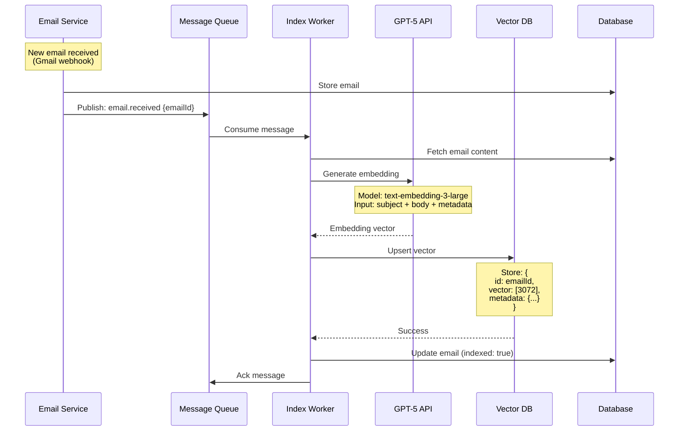
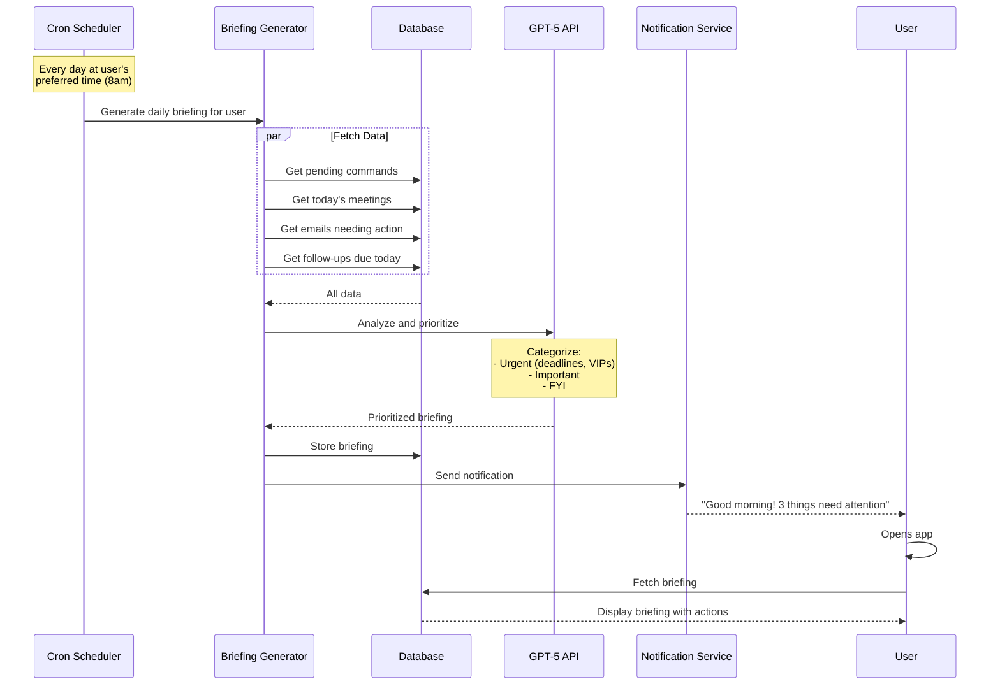
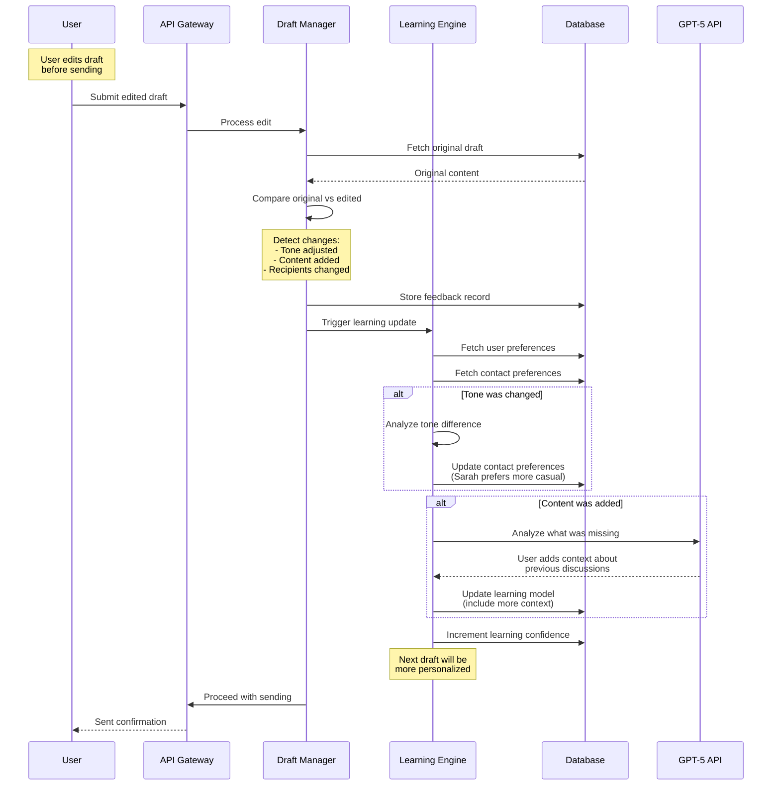

# Data Models & Flow Diagrams

## Core Data Entities

### User

```typescript
type User = {
  id: string; // UUID
  email: string;
  name: string;
  emailProvider: 'gmail' | 'outlook';
  emailCredentials: EncryptedCredentials; // OAuth tokens
  calendarProvider: 'google' | 'outlook';
  calendarCredentials: EncryptedCredentials;
  phoneNumber?: string;
  timezone: string; // IANA timezone
  createdAt: Date;
  lastActiveAt: Date;
};

type EncryptedCredentials = {
  accessToken: string; // Encrypted
  refreshToken: string; // Encrypted
  expiresAt: Date;
  scope: string[];
};
```

### UserPreferences

```typescript
type UserPreferences = {
  id: string;
  userId: string;

  // Communication style
  defaultTone: 'professional' | 'casual' | 'friendly' | 'formal';
  emailSignature: string;
  signOffPhrase: string; // "Best," "Regards," etc.

  // Automation settings
  autoAcceptMeetings: boolean;
  autoAcceptMeetingsFrom: 'all' | 'vip_only' | 'none';
  autoRespondSimple: boolean;
  autoRespondConfidence: 'high' | 'medium'; // Only auto-respond if confidence > threshold

  // Notification preferences
  notificationPreferences: {
    interruptions: {
      vipEmails: boolean;
      meetingReminders: boolean;
      urgentDeadlines: boolean;
      trackedResponses: boolean;
    };
    batchInterval: number; // minutes
    quietHours: {
      enabled: boolean;
      start: string; // "22:00"
      end: string; // "08:00"
    };
  };

  // VIP contacts
  vipContacts: Array<{
    email: string;
    name: string;
    relationship: 'boss' | 'client' | 'colleague';
  }>;

  // Follow-up defaults
  followUpDefaults: {
    autoTrackingDays: number; // Default days before follow-up
    followUpTone: 'gentle' | 'neutral' | 'urgent';
  };

  createdAt: Date;
  updatedAt: Date;
};
```

### Command

```typescript
type Command = {
  id: string;
  userId: string;

  // Input
  transcript: string; // Voice input transcribed
  audioFileUrl?: string; // S3 URL of audio recording (optional)

  // Intent classification
  intent: CommandIntent;
  intentData: Record<string, unknown>; // Parsed entities
  confidence: number; // 0-1

  // Execution
  status: 'pending' | 'processing' | 'pending_approval' | 'completed' | 'failed' | 'cancelled';
  result?: CommandResult;
  error?: {
    message: string;
    code: string;
    details?: unknown;
  };

  // Timing
  timestamp: Date;
  processingStartedAt?: Date;
  completedAt?: Date;

  // Metadata
  deviceType: 'ios' | 'android' | 'web';
  appVersion: string;
};

type CommandIntent =
  | 'schedule_meeting'
  | 'draft_email'
  | 'send_email'
  | 'search_email'
  | 'get_meeting_context'
  | 'reschedule_meeting'
  | 'cancel_meeting'
  | 'set_follow_up'
  | 'get_daily_brief';

type CommandResult = {
  type: 'draft' | 'action_completed' | 'information';
  data: Draft | ActionCompleted | Information;
};
```

### Email

```typescript
type Email = {
  id: string;
  userId: string;

  // External IDs
  externalId: string; // Gmail/Outlook message ID
  threadId: string; // Conversation thread

  // Content
  from: string;
  to: string[];
  cc?: string[];
  bcc?: string[];
  subject: string;
  body: string; // HTML or plain text
  snippet: string; // First 200 chars for preview
  attachments?: Attachment[];

  // Metadata
  direction: 'sent' | 'received';
  date: Date;
  labels: string[]; // Gmail labels or Outlook categories
  isRead: boolean;
  isStarred: boolean;
  isImportant: boolean;

  // AI enrichment
  indexed: boolean; // Indexed in vector DB
  embeddingId?: string; // Vector DB ID
  priority?: 'urgent' | 'high' | 'normal' | 'low';
  category?: 'action_needed' | 'waiting_on' | 'fyi' | 'newsletter';

  createdAt: Date;
  updatedAt: Date;
};

type Attachment = {
  id: string;
  filename: string;
  mimeType: string;
  size: number; // bytes
  url: string; // S3 URL or external URL
};
```

### CalendarEvent

```typescript
type CalendarEvent = {
  id: string;
  userId: string;

  // External ID
  externalId: string; // Google/Outlook event ID

  // Basic info
  title: string;
  description?: string;
  location?: string;

  // Timing
  start: Date;
  end: Date;
  isAllDay: boolean;
  timezone: string;

  // Participants
  attendees: Attendee[];
  organizer: {
    email: string;
    name?: string;
  };

  // Status
  status: 'confirmed' | 'tentative' | 'cancelled';
  responseStatus: 'accepted' | 'declined' | 'tentative' | 'needsAction';

  // Meeting details
  meetingUrl?: string; // Zoom, Meet, etc.
  conferenceData?: {
    type: 'zoom' | 'meet' | 'teams';
    url: string;
    dialIn?: string;
  };

  // Recurrence
  recurrence?: {
    frequency: 'daily' | 'weekly' | 'monthly' | 'yearly';
    interval: number;
    until?: Date;
    count?: number;
  };

  // AI enrichment
  aiSuggestions?: {
    preparationNeeded: boolean;
    relatedEmails: string[]; // Email IDs
    suggestedTopics: string[];
  };

  createdAt: Date;
  updatedAt: Date;
};

type Attendee = {
  email: string;
  name?: string;
  responseStatus: 'accepted' | 'declined' | 'tentative' | 'needsAction';
  optional: boolean;
};
```

### Draft

```typescript
type Draft = {
  id: string;
  userId: string;
  commandId: string; // Associated command

  // Type
  type: 'email' | 'meeting_request' | 'meeting_update';

  // Email draft
  emailDraft?: {
    to: string[];
    cc?: string[];
    subject: string;
    body: string;
    inReplyTo?: string; // Thread ID
    tone: string;
  };

  // Meeting draft
  meetingDraft?: {
    title: string;
    participants: string[];
    proposedTimes: Date[];
    duration: number; // minutes
    location?: string;
    description?: string;
  };

  // Status
  status: 'pending_review' | 'approved' | 'rejected' | 'edited' | 'sent';

  // User modifications
  userEdits?: {
    originalContent: string;
    editedContent: string;
    editType: 'tone_change' | 'content_change' | 'recipient_change';
    timestamp: Date;
  };

  // Execution
  sentAt?: Date;
  sentMessageId?: string; // Email/event ID after sending

  createdAt: Date;
};
```

### FollowUp

```typescript
type FollowUp = {
  id: string;
  userId: string;

  // What to follow up on
  emailThreadId?: string;
  meetingId?: string;
  type: 'email_response' | 'meeting_acceptance' | 'custom';

  // When
  followUpAt: Date;
  status: 'active' | 'completed' | 'cancelled' | 'snoozed';

  // Action
  followUpAction: 'notify_user' | 'draft_reminder' | 'auto_send';
  followUpMessage?: string; // Pre-drafted message

  // Conditions
  conditions?: {
    ifNoResponseFrom?: string[]; // Email addresses
    ifEventNotAccepted?: boolean;
  };

  // Execution
  executedAt?: Date;
  result?: {
    action: string;
    success: boolean;
    details?: unknown;
  };

  createdAt: Date;
  completedAt?: Date;
};
```

### ContactPreferences

```typescript
type ContactPreferences = {
  id: string;
  userId: string;

  // Contact info
  contactEmail: string;
  contactName?: string;

  // Learned preferences
  preferredTone: 'professional' | 'casual' | 'friendly' | 'formal';
  relationshipType: 'colleague' | 'client' | 'friend' | 'boss' | 'vendor';

  // Custom instructions
  customInstructions?: string; // "Always CC their assistant" etc.

  // Interaction stats
  interactionCount: number;
  lastInteraction: Date;
  averageResponseTime?: number; // minutes

  // AI-learned patterns
  patterns?: {
    preferredMeetingTimes?: string[]; // ["Tuesday afternoon", "Friday morning"]
    communicationStyle?: string;
    commonTopics?: string[];
  };

  createdAt: Date;
  updatedAt: Date;
};
```

### Feedback

```typescript
type Feedback = {
  id: string;
  userId: string;
  commandId: string;

  // Type of feedback
  feedbackType: 'approve' | 'edit' | 'reject' | 'rating';

  // Edit details
  changes?: {
    field: string; // 'tone', 'content', 'recipient'
    originalValue: unknown;
    newValue: unknown;
  }[];

  // Rating
  rating?: number; // 1-5 stars

  // Comments
  comment?: string;

  timestamp: Date;
};
```

### AuditLog

```typescript
type AuditLog = {
  id: string;
  userId: string;

  // What happened
  action: string; // 'email_sent', 'meeting_created', 'draft_edited', etc.
  entityType: 'email' | 'calendar_event' | 'command' | 'draft';
  entityId: string;

  // Details
  metadata: {
    [key: string]: unknown;
  };

  // When
  timestamp: Date;

  // Context
  ipAddress?: string;
  userAgent?: string;
  deviceType?: 'ios' | 'android' | 'web';
};
```

---

## Data Flow Diagrams

### Flow 1: Voice Command → Meeting Scheduled



### Flow 2: Context Retrieval (Semantic Search)



### Flow 3: Email Indexing (Background Job)



### Flow 4: Daily Briefing Generation



### Flow 5: Learning from User Edits



---

## State Machines

### Command State Machine

```typescript
type CommandState =
  | 'pending'          // Initial state
  | 'processing'       // GPT-5 analyzing
  | 'pending_approval' // Waiting for user
  | 'approved'         // User approved
  | 'executing'        // Sending email, creating event
  | 'completed'        // Success
  | 'failed'           // Error occurred
  | 'cancelled';       // User cancelled

// Valid transitions:
const transitions = {
  pending: ['processing', 'cancelled'],
  processing: ['pending_approval', 'completed', 'failed'],
  pending_approval: ['approved', 'cancelled'],
  approved: ['executing', 'failed'],
  executing: ['completed', 'failed'],
  completed: [], // Terminal state
  failed: [], // Terminal state
  cancelled: [] // Terminal state
};
```

### Draft State Machine

```typescript
type DraftState =
  | 'pending_review'  // Initial state, shown to user
  | 'approved'        // User approved as-is
  | 'edited'          // User made changes
  | 'rejected'        // User rejected
  | 'sent';           // Email sent / event created

const transitions = {
  pending_review: ['approved', 'edited', 'rejected'],
  approved: ['sent'],
  edited: ['sent'],
  rejected: [], // Terminal
  sent: [] // Terminal
};
```

---

## Caching Strategy

### Cache Layers

```typescript
// L1: In-memory (Node.js process)
const inMemoryCache = new Map<string, { data: any; expiresAt: number }>();

// L2: Redis (shared across instances)
const redisCache = new Redis(process.env.REDIS_URL);

// L3: Database (persistent)
const db = new PrismaClient();
```

### Cache Keys & TTLs

```typescript
const CACHE_KEYS = {
  // User data (TTL: 1 hour)
  userPreferences: (userId: string) => `user:${userId}:prefs`,
  userContext: (userId: string) => `user:${userId}:context`,

  // Calendar (TTL: 5 minutes - changes frequently)
  calendarEvents: (userId: string, date: string) => `cal:${userId}:${date}`,
  availability: (userId: string, range: string) => `avail:${userId}:${range}`,

  // Email (TTL: 1 minute - very dynamic)
  emailThread: (threadId: string) => `email:thread:${threadId}`,
  emailCount: (userId: string) => `email:count:${userId}`,

  // Contact data (TTL: 1 day)
  contactPrefs: (userId: string, contact: string) => `contact:${userId}:${contact}`,

  // Embeddings (TTL: permanent - expensive to generate)
  emailEmbedding: (emailId: string) => `embed:${emailId}`,
};

const TTL = {
  user: 3600,        // 1 hour
  calendar: 300,     // 5 minutes
  email: 60,         // 1 minute
  contact: 86400,    // 1 day
  embedding: null    // No expiry
};
```

### Cache Invalidation

```typescript
// Event-driven invalidation
eventBus.on('email.received', async ({ userId, emailId }) => {
  // Invalidate email caches
  await redis.del(CACHE_KEYS.emailCount(userId));
  await redis.del(`email:recent:${userId}`);
});

eventBus.on('calendar.event.created', async ({ userId, date }) => {
  // Invalidate calendar caches
  await redis.del(CACHE_KEYS.calendarEvents(userId, date));
  await redis.del(CACHE_KEYS.availability(userId, 'this_week'));
});

eventBus.on('user.preferences.updated', async ({ userId }) => {
  // Invalidate user caches
  await redis.del(CACHE_KEYS.userPreferences(userId));
  await redis.del(CACHE_KEYS.userContext(userId));
});
```

---

## Database Indexing Strategy

### Critical Indices

```sql
-- User lookups (very frequent)
CREATE INDEX idx_users_email ON users(email);

-- Email queries (most common)
CREATE INDEX idx_emails_user_date ON emails(user_id, date DESC);
CREATE INDEX idx_emails_thread ON emails(thread_id);
CREATE INDEX idx_emails_from ON emails(user_id, from);
CREATE INDEX idx_emails_unread ON emails(user_id, is_read) WHERE is_read = false;

-- Calendar queries
CREATE INDEX idx_calendar_user_start ON calendar_events(user_id, start);
CREATE INDEX idx_calendar_user_date_range ON calendar_events(user_id, start, end);

-- Commands (for analytics)
CREATE INDEX idx_commands_user_timestamp ON commands(user_id, timestamp DESC);
CREATE INDEX idx_commands_status ON commands(user_id, status);

-- Follow-ups
CREATE INDEX idx_followups_due ON follow_ups(user_id, follow_up_at) WHERE status = 'active';

-- Contact preferences
CREATE INDEX idx_contact_prefs_lookup ON contact_preferences(user_id, contact_email);

-- Audit logs (for compliance)
CREATE INDEX idx_audit_user_timestamp ON audit_logs(user_id, timestamp DESC);
CREATE INDEX idx_audit_entity ON audit_logs(entity_type, entity_id);
```

### Composite Indices for Common Queries

```sql
-- Get unread urgent emails
CREATE INDEX idx_emails_urgent_unread ON emails(user_id, priority, is_read)
  WHERE priority = 'urgent' AND is_read = false;

-- Get today's meetings
CREATE INDEX idx_calendar_today ON calendar_events(user_id, start)
  WHERE start >= CURRENT_DATE AND start < CURRENT_DATE + INTERVAL '1 day';

-- Get pending commands
CREATE INDEX idx_commands_pending ON commands(user_id, status, timestamp DESC)
  WHERE status = 'pending_approval';
```

---

## Data Retention & Archival

### Retention Policies

```typescript
const RETENTION_POLICIES = {
  // Active data
  emails: {
    hot: 90,        // Last 90 days in main DB
    warm: 365,      // 90-365 days in archive (S3)
    cold: Infinity  // >1 year in cold storage (Glacier)
  },

  calendarEvents: {
    future: Infinity, // All future events
    past: 365         // Keep past events for 1 year
  },

  commands: {
    hot: 30,          // Last 30 days for quick access
    archive: 365      // Keep for 1 year for analytics
  },

  auditLogs: {
    retention: 2555,  // 7 years (compliance)
    archive: 2555
  }
};
```

### Archival Job (Nightly)

```typescript
async function archiveOldData() {
  const cutoffDate = new Date();
  cutoffDate.setDate(cutoffDate.getDate() - 90);

  // Archive old emails to S3
  const oldEmails = await db.email.findMany({
    where: {
      date: { lt: cutoffDate },
      archived: false
    },
    take: 1000
  });

  for (const email of oldEmails) {
    // Upload to S3
    await s3.putObject({
      Bucket: 'tide-email-archive',
      Key: `emails/${email.userId}/${email.id}.json`,
      Body: JSON.stringify(email),
      StorageClass: 'STANDARD_IA' // Infrequent Access
    });

    // Mark as archived
    await db.email.update({
      where: { id: email.id },
      data: { archived: true, body: null } // Remove body from DB
    });
  }

  logger.info(`Archived ${oldEmails.length} emails to S3`);
}
```

---

## Scaling Considerations

### Sharding Strategy (When >10M users)

```typescript
// Shard by user ID hash
function getShardForUser(userId: string): number {
  const hash = crypto.createHash('md5').update(userId).digest('hex');
  const hashInt = parseInt(hash.substring(0, 8), 16);
  return hashInt % NUM_SHARDS;
}

// Database connections per shard
const dbConnections: Map<number, PrismaClient> = new Map();

for (let i = 0; i < NUM_SHARDS; i++) {
  dbConnections.set(i, new PrismaClient({
    datasources: {
      db: { url: process.env[`DATABASE_SHARD_${i}_URL`] }
    }
  }));
}

// Use correct shard for user
async function getUserData(userId: string) {
  const shard = getShardForUser(userId);
  const db = dbConnections.get(shard)!;

  return db.user.findUnique({ where: { id: userId } });
}
```

### Read Replicas for Scalability

```typescript
// Write to primary
const primaryDB = new PrismaClient({
  datasources: { db: { url: process.env.DATABASE_PRIMARY_URL } }
});

// Read from replicas (round-robin)
const replicaDBs = [
  new PrismaClient({ datasources: { db: { url: process.env.DATABASE_REPLICA_1_URL } } }),
  new PrismaClient({ datasources: { db: { url: process.env.DATABASE_REPLICA_2_URL } } })
];

let replicaIndex = 0;

function getReadDB(): PrismaClient {
  const db = replicaDBs[replicaIndex];
  replicaIndex = (replicaIndex + 1) % replicaDBs.length;
  return db;
}

// Usage
async function getUser(userId: string) {
  return getReadDB().user.findUnique({ where: { id: userId } });
}

async function updateUser(userId: string, data: any) {
  return primaryDB.user.update({ where: { id: userId }, data });
}
```

---

## Data Privacy & Compliance

### PII Data Handling

```typescript
// Mark PII fields
const PII_FIELDS = {
  user: ['email', 'name', 'phoneNumber'],
  email: ['from', 'to', 'cc', 'bcc', 'body'],
  calendarEvent: ['attendees', 'description', 'location']
};

// Anonymize for analytics
function anonymizeUser(user: User): AnonymizedUser {
  return {
    id: crypto.createHash('sha256').update(user.id).digest('hex'), // One-way hash
    createdAt: user.createdAt,
    lastActiveAt: user.lastActiveAt,
    // Exclude: email, name, phone
  };
}

// Data export (GDPR)
async function exportUserData(userId: string): Promise<UserDataExport> {
  const [user, emails, events, commands] = await Promise.all([
    db.user.findUnique({ where: { id: userId } }),
    db.email.findMany({ where: { userId } }),
    db.calendarEvent.findMany({ where: { userId } }),
    db.command.findMany({ where: { userId } })
  ]);

  return {
    personal_data: user,
    emails,
    calendar_events: events,
    commands,
    exported_at: new Date()
  };
}

// Data deletion (GDPR Right to be Forgotten)
async function deleteUserData(userId: string): Promise<void> {
  await db.$transaction([
    db.email.deleteMany({ where: { userId } }),
    db.calendarEvent.deleteMany({ where: { userId } }),
    db.command.deleteMany({ where: { userId } }),
    db.draft.deleteMany({ where: { userId } }),
    db.followUp.deleteMany({ where: { userId } }),
    db.contactPreferences.deleteMany({ where: { userId } }),
    db.feedback.deleteMany({ where: { userId } }),
    db.auditLog.deleteMany({ where: { userId } }),
    db.userPreferences.delete({ where: { userId } }),
    db.user.delete({ where: { id: userId } })
  ]);

  // Delete from vector DB
  await vectorDB.delete({ filter: { userId } });

  // Delete from S3
  await s3.deleteObjects({
    Bucket: 'tide-email-archive',
    Delete: {
      Objects: [{ Key: `emails/${userId}/` }]
    }
  });

  logger.info({ userId }, 'User data deleted');
}
```

---

## API Rate Limiting

### Per-User Limits

```typescript
const RATE_LIMITS = {
  free: {
    commands_per_minute: 5,
    commands_per_day: 50,
    api_calls_per_minute: 20
  },
  pro: {
    commands_per_minute: 20,
    commands_per_day: 500,
    api_calls_per_minute: 100
  },
  enterprise: {
    commands_per_minute: 100,
    commands_per_day: Infinity,
    api_calls_per_minute: 500
  }
};

async function checkRateLimit(userId: string, tier: 'free' | 'pro' | 'enterprise'): Promise<void> {
  const limits = RATE_LIMITS[tier];

  // Check per-minute limit
  const minuteKey = `ratelimit:${userId}:minute:${Math.floor(Date.now() / 60000)}`;
  const minuteCount = await redis.incr(minuteKey);
  await redis.expire(minuteKey, 60);

  if (minuteCount > limits.commands_per_minute) {
    throw new RateLimitError('Rate limit exceeded (per minute)', 60);
  }

  // Check per-day limit
  const dayKey = `ratelimit:${userId}:day:${new Date().toISOString().split('T')[0]}`;
  const dayCount = await redis.incr(dayKey);
  await redis.expire(dayKey, 86400);

  if (dayCount > limits.commands_per_day) {
    throw new RateLimitError('Daily limit exceeded', 86400);
  }
}
```

---

## Key Metrics to Track

### Business Metrics (Per User)
- Commands per day
- Email drafts approved without edits
- Time saved (estimated)
- Meetings scheduled
- Emails sent via Tide
- Follow-ups completed

### Technical Metrics (System-wide)
- Command processing latency (p50, p95, p99)
- GPT-5 API call success rate
- Email send success rate
- Database query performance
- Cache hit rate
- Vector search latency
- Background job queue depth

### Data Metrics
- Total emails indexed
- Vector DB size
- Database size per user
- S3 storage per user
- Daily data growth rate
