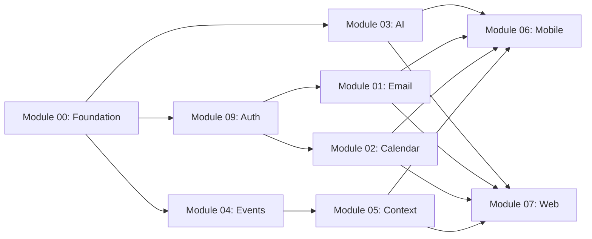

# 🚀 Tide Execution Plan - Phased Implementation

## 📊 Current State Assessment

### Module 00 Status: ⚠️ **Partially Complete (60%)**

#### ✅ Completed:
- **Core Types** (`@tide/types`): Comprehensive conversational types defined
  - IConversation, IMessage, IAction, IActionPreview
  - Intent types, context types, personalization types
  - Base Result type with functional error handling
- **Service Contracts** (`@tide/contracts`): All interfaces defined
  - IConversationService, IEmailService, ICalendarService
  - IAgentService, IContextService, IEventStore
  - Performance requirements specified
- **Basic Mocks**: MockEmailService implemented with tests
- **Documentation**: Module documentation complete

#### ❌ Missing:
- **Conversation Schemas**: No Zod validation for conversation types
- **Mock Implementations**: Need MockConversationService, MockCalendarService, etc.
- **Action Preview Service**: Implementation missing
- **Natural Language Processor**: Contract exists but no mock
- **Integration Tests**: No end-to-end conversation flow tests

### Codebase Structure:
```
✅ /packages/types       - Base types (complete)
✅ /packages/contracts   - Service interfaces (complete)
⚠️ /packages/schemas     - Validation schemas (partial - missing conversation)
⚠️ /packages/mocks       - Mock implementations (only email done)
❌ /apps                 - No applications yet
❌ /services             - No service implementations
```

---

## 🎯 Execution Strategy

### Core Principles:
1. **Foundation First**: Complete Module 00 before starting others
2. **Parallel Development**: Run 3-4 modules concurrently per phase
3. **Integration Points**: Clear handoff between phases
4. **Risk Mitigation**: Critical path modules get priority

---

## 📅 Phase 0: Foundation Completion (Week 1)
**Goal**: Complete Module 00 to unblock all other development

### Critical Tasks:
```typescript
// Must complete before ANY other module can start
- [ ] Create conversation schemas (conversation.schemas.ts)
- [ ] Implement MockConversationService
- [ ] Implement MockActionPreviewService
- [ ] Create integration test suite
- [ ] Build basic CLI for testing conversations
```

### Team Allocation:
- **Developer 1**: Conversation schemas + MockConversationService
- **Developer 2**: MockActionPreviewService + MockNaturalLanguageProcessor
- **Developer 3**: Integration tests + basic CLI

### Exit Criteria:
- All mocks return valid data
- Integration tests pass
- Can have a basic text conversation through CLI

---

## 📅 Phase 1: Core Services (Weeks 2-4)
**Goal**: Build the essential services that all features depend on

### Parallel Execution:
```
┌─────────────────────────────────────────────────┐
│              PHASE 1 - CORE SERVICES            │
├─────────────────────────────────────────────────┤
│                                                 │
│  Module 03: AI Agent System (Critical Path)    │
│  └─ Focus: Conversation understanding          │
│  └─ Dependencies: Module 00 only               │
│  └─ Developer: Senior AI Engineer              │
│                                                 │
│  Module 04: Event Sourcing (Foundation)        │
│  └─ Focus: Event store, CQRS setup            │
│  └─ Dependencies: Module 00 only               │
│  └─ Developer: Backend Architect               │
│                                                 │
│  Module 09: Security & Auth (Blocker)          │
│  └─ Focus: OAuth flows for Gmail/Outlook       │
│  └─ Dependencies: Module 00 only               │
│  └─ Developer: Security Engineer               │
│                                                 │
└─────────────────────────────────────────────────┘
```

### Why These Three:
- **Module 03**: Without AI understanding, nothing works
- **Module 04**: Event sourcing needed by all services
- **Module 09**: OAuth required before email/calendar integration

### Integration Points:
- Module 03 → Provides intent extraction for all services
- Module 04 → Provides audit trail for all operations
- Module 09 → Provides auth tokens for external services

---

## 📅 Phase 2: Service Integration (Weeks 5-7)
**Goal**: Build email, calendar, and context services

### Parallel Execution:
```
┌─────────────────────────────────────────────────┐
│            PHASE 2 - SERVICE INTEGRATION        │
├─────────────────────────────────────────────────┤
│                                                 │
│  Module 01: Email Service                      │
│  └─ Focus: Gmail/Outlook integration           │
│  └─ Dependencies: Modules 00, 09 (OAuth)       │
│  └─ Developer: Full-Stack Engineer #1          │
│                                                 │
│  Module 02: Calendar Service                   │
│  └─ Focus: Smart scheduling                    │
│  └─ Dependencies: Modules 00, 09 (OAuth)       │
│  └─ Developer: Full-Stack Engineer #2          │
│                                                 │
│  Module 05: Context Engine                     │
│  └─ Focus: Semantic understanding              │
│  └─ Dependencies: Modules 00, 04 (Events)      │
│  └─ Developer: ML Engineer                     │
│                                                 │
└─────────────────────────────────────────────────┘
```

### Why This Order:
- Email and Calendar can run in parallel (different teams)
- Context Engine can start once Event Sourcing is ready
- All three are needed for meaningful conversations

### Integration Checkpoint:
- Week 7: Full conversation → email action flow working

---

## 📅 Phase 3: User Interfaces (Weeks 8-10)
**Goal**: Build web and mobile applications

### Parallel Execution:
```
┌─────────────────────────────────────────────────┐
│              PHASE 3 - USER INTERFACES          │
├─────────────────────────────────────────────────┤
│                                                 │
│  Module 06: Mobile App                         │
│  └─ Focus: React Native, offline-first         │
│  └─ Dependencies: Modules 00-05                │
│  └─ Developer: Mobile Engineer                 │
│                                                 │
│  Module 07: Web App                           │
│  └─ Focus: Next.js chat interface             │
│  └─ Dependencies: Modules 00-05                │
│  └─ Developer: Frontend Engineer               │
│                                                 │
│  Module 10: Performance & Caching             │
│  └─ Focus: Multi-tier cache, <200ms response  │
│  └─ Dependencies: All backend modules          │
│  └─ Developer: Performance Engineer            │
│                                                 │
└─────────────────────────────────────────────────┘
```

### Why This Timing:
- UIs need working backend services
- Can develop both platforms in parallel
- Performance optimization runs alongside to ensure targets

---

## 📅 Phase 4: Intelligence & Polish (Weeks 11-12)
**Goal**: Add learning, analytics, and polish

### Final Sprint:
```
┌─────────────────────────────────────────────────┐
│           PHASE 4 - INTELLIGENCE & POLISH       │
├─────────────────────────────────────────────────┤
│                                                 │
│  Module 08: Learning & Analytics               │
│  └─ Focus: Personalization, insights           │
│  └─ Dependencies: All modules                  │
│  └─ Developer: Data Scientist                  │
│                                                 │
│  Integration Testing & Bug Fixes               │
│  └─ Focus: End-to-end testing                 │
│  └─ All developers                            │
│                                                 │
└─────────────────────────────────────────────────┘
```

---

## 🚨 Critical Path Analysis

### Blocking Dependencies:


### High-Risk Items:
1. **OAuth Implementation** (Module 09) - Blocks email/calendar
2. **AI Intent Extraction** (Module 03) - Blocks everything
3. **Conversation State Management** (Module 00) - Foundation

---

## 📊 Resource Allocation

### Team Size: 8-10 developers

#### Recommended Allocation:
- **2 Senior Engineers**: Module 00 completion + Module 03 (AI)
- **1 Security Engineer**: Module 09 (Auth/OAuth)
- **1 Backend Architect**: Module 04 (Event Sourcing)
- **2 Full-Stack Engineers**: Modules 01 & 02 (Email/Calendar)
- **1 ML Engineer**: Module 05 (Context Engine)
- **1 Mobile Engineer**: Module 06
- **1 Frontend Engineer**: Module 07
- **1 Performance Engineer**: Module 10

### Skills Matrix:
```
Module | Required Skills              | Priority | Complexity
-------|------------------------------|----------|------------
00     | TypeScript, Testing          | CRITICAL | Medium
01     | OAuth, Gmail API             | HIGH     | High
02     | OAuth, Calendar APIs         | HIGH     | High
03     | AI/ML, NLP, LangChain       | CRITICAL | Very High
04     | Event Sourcing, CQRS        | HIGH     | High
05     | Vector DB, Semantic Search  | MEDIUM   | High
06     | React Native, Offline-first | MEDIUM   | Medium
07     | Next.js, WebSockets         | MEDIUM   | Low
08     | Analytics, ML               | LOW      | Medium
09     | OAuth, Security, Crypto     | CRITICAL | High
10     | Caching, Performance        | MEDIUM   | Medium
```

---

## ✅ Week 1 Action Items

### Immediate Tasks (Next 3 Days):
```bash
# Complete Module 00 Foundation
1. Create conversation.schemas.ts with Zod validation
2. Implement MockConversationService
3. Implement MockActionPreviewService
4. Add integration tests for conversation flow
5. Build simple CLI to test conversation

# Setup for Phase 1
6. Create project structure for apps/
7. Setup CI/CD pipeline
8. Create development environment setup script
```

### Success Criteria for Week 1:
- [ ] Can have a text conversation through CLI
- [ ] All mocks return valid typed data
- [ ] Integration tests pass
- [ ] Module contracts are frozen (no more changes)
- [ ] Teams assigned to Phase 1 modules

---

## 🎯 Key Success Factors

### 1. Module 00 Must Be Complete
- No shortcuts - this is the foundation
- All types, contracts, schemas, and mocks
- Comprehensive tests

### 2. Parallel Development Works Only If:
- Contracts are truly frozen after Module 00
- Mocks are comprehensive
- Integration points are well-defined

### 3. Weekly Integration Checkpoints
- Every Friday: Integration test run
- Identify contract violations early
- Course-correct quickly

### 4. Performance Targets From Day 1
- Every module must meet performance requirements
- Test with realistic data volumes
- Profile and optimize continuously

---

## 📈 Progress Tracking

### Weekly Milestones:
- **Week 1**: Module 00 complete, Phase 1 started
- **Week 2**: AI understanding working (Module 03)
- **Week 3**: Event sourcing operational (Module 04)
- **Week 4**: OAuth flows complete (Module 09)
- **Week 5**: Email operations working (Module 01)
- **Week 6**: Calendar scheduling working (Module 02)
- **Week 7**: Context engine online (Module 05)
- **Week 8**: Web app alpha (Module 07)
- **Week 9**: Mobile app alpha (Module 06)
- **Week 10**: Performance targets met (Module 10)
- **Week 11**: Learning system active (Module 08)
- **Week 12**: Beta ready for testing

---

## 🚦 Go/No-Go Decision Points

### Phase Gate Reviews:
1. **End of Week 1**: Foundation solid? → Proceed to Phase 1
2. **End of Week 4**: Core services working? → Proceed to Phase 2
3. **End of Week 7**: Services integrated? → Proceed to Phase 3
4. **End of Week 10**: UIs functional? → Proceed to Phase 4
5. **End of Week 12**: Ready for beta? → Launch decision

---

## 🎯 Conclusion

**Module 00 is NOT complete** - it needs 1 week of focused work before any other development can begin. Once complete, the phased approach allows for efficient parallel development while managing dependencies.

The critical path runs through: Module 00 → Module 03 (AI) → Everything else

Start with completing the foundation, then execute phases with discipline.