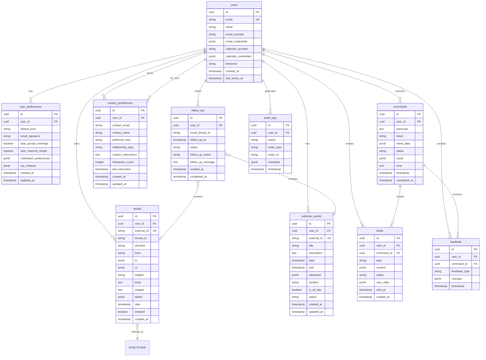

# Phase 0: Foundation & Contracts - Detailed Implementation Guide

## Timeline: Week 1-2 (Days 1-14)
## Team: All engineers (5-6 people)
## Goal: Define everything that enables parallel work

---

## Week 1: Architecture Definition

### Day 1: Project Structure & Monorepo Setup

**Engineer Assignment**: Lead + 1 engineer

#### 1.1 Initialize Monorepo

```bash
# Create project structure
mkdir -p tide/{apps,packages,docs,infrastructure,scripts}
cd tide

# Initialize pnpm workspace
pnpm init

# Create workspace config
cat > pnpm-workspace.yaml <<EOF
packages:
  - 'apps/*'
  - 'packages/*'
EOF
```

#### 1.2 Create Package Structure

```bash
# Applications
mkdir -p apps/{api,mobile,web}

# Shared packages
mkdir -p packages/{shared-types,validation,api-contracts,mocks,config,design-system}

# Create package.json for each
for dir in apps/* packages/*; do
  cd "$dir"
  pnpm init
  cd -
done
```

#### 1.3 Root package.json

```json
{
  "name": "tide-monorepo",
  "version": "0.1.0",
  "private": true,
  "scripts": {
    "dev": "turbo run dev",
    "build": "turbo run build",
    "test": "turbo run test",
    "lint": "turbo run lint",
    "type-check": "turbo run type-check",
    "clean": "turbo run clean && rm -rf node_modules",
    "format": "prettier --write \"**/*.{ts,tsx,md,json}\"",
    "db:migrate": "pnpm --filter api db:migrate",
    "db:seed": "pnpm --filter api db:seed",
    "db:reset": "pnpm --filter api db:reset"
  },
  "devDependencies": {
    "@typescript-eslint/eslint-plugin": "^6.0.0",
    "@typescript-eslint/parser": "^6.0.0",
    "eslint": "^8.50.0",
    "eslint-config-prettier": "^9.0.0",
    "husky": "^8.0.3",
    "lint-staged": "^15.0.0",
    "prettier": "^3.0.3",
    "turbo": "^1.10.0",
    "typescript": "^5.2.0"
  },
  "engines": {
    "node": ">=20.0.0",
    "pnpm": ">=8.0.0"
  }
}
```

#### 1.4 TypeScript Configuration

```json
// tsconfig.json (root)
{
  "compilerOptions": {
    "target": "ES2022",
    "lib": ["ES2022"],
    "module": "NodeNext",
    "moduleResolution": "NodeNext",
    "esModuleInterop": true,
    "skipLibCheck": true,
    "strict": true,
    "strictNullChecks": true,
    "strictFunctionTypes": true,
    "noImplicitAny": true,
    "noImplicitThis": true,
    "noUnusedLocals": true,
    "noUnusedParameters": true,
    "noImplicitReturns": true,
    "noFallthroughCasesInSwitch": true,
    "forceConsistentCasingInFileNames": true,
    "resolveJsonModule": true,
    "isolatedModules": true,
    "incremental": true
  }
}
```

```json
// apps/api/tsconfig.json
{
  "extends": "../../tsconfig.json",
  "compilerOptions": {
    "outDir": "./dist",
    "rootDir": "./src",
    "paths": {
      "@/*": ["./src/*"],
      "@tide/types": ["../../packages/shared-types/src"],
      "@tide/validation": ["../../packages/validation/src"],
      "@tide/contracts": ["../../packages/api-contracts/src"],
      "@tide/mocks": ["../../packages/mocks/src"]
    }
  },
  "include": ["src/**/*"],
  "exclude": ["node_modules", "dist", "**/*.test.ts"]
}
```

#### 1.5 ESLint & Prettier

```json
// .eslintrc.json
{
  "root": true,
  "parser": "@typescript-eslint/parser",
  "parserOptions": {
    "project": "./tsconfig.json",
    "ecmaVersion": 2022,
    "sourceType": "module"
  },
  "plugins": ["@typescript-eslint", "import"],
  "extends": [
    "eslint:recommended",
    "plugin:@typescript-eslint/recommended",
    "plugin:@typescript-eslint/recommended-requiring-type-checking",
    "prettier"
  ],
  "rules": {
    "@typescript-eslint/no-explicit-any": "error",
    "@typescript-eslint/no-unused-vars": ["error", {
      "argsIgnorePattern": "^_",
      "varsIgnorePattern": "^_"
    }],
    "@typescript-eslint/explicit-function-return-type": ["warn", {
      "allowExpressions": true
    }],
    "@typescript-eslint/no-floating-promises": "error",
    "@typescript-eslint/no-misused-promises": "error",
    "@typescript-eslint/await-thenable": "error",
    "import/order": ["error", {
      "groups": [
        "builtin",
        "external",
        "internal",
        "parent",
        "sibling",
        "index"
      ],
      "newlines-between": "always",
      "alphabetize": { "order": "asc" }
    }],
    "no-console": ["warn", { "allow": ["warn", "error"] }],
    "prefer-const": "error",
    "no-var": "error"
  }
}
```

```json
// .prettierrc
{
  "semi": true,
  "trailingComma": "es5",
  "singleQuote": true,
  "printWidth": 100,
  "tabWidth": 2,
  "useTabs": false,
  "arrowParens": "always",
  "endOfLine": "lf"
}
```

#### 1.6 Git Hooks (Husky)

```bash
# Install husky
pnpm add -D husky
npx husky install

# Create pre-commit hook
npx husky add .husky/pre-commit "pnpm lint-staged"
```

```json
// package.json addition
{
  "lint-staged": {
    "*.{ts,tsx}": [
      "eslint --fix",
      "prettier --write"
    ],
    "*.{json,md}": [
      "prettier --write"
    ]
  }
}
```

**Deliverables Day 1**:
- [ ] Monorepo structure created
- [ ] TypeScript configured (strict mode)
- [ ] ESLint + Prettier configured
- [ ] Git hooks working (test by making a commit)
- [ ] All packages can import from each other

---

### Day 2-3: Complete Database Schema Design

**Engineer Assignment**: Lead + Backend Engineers #1, #2, #3

**Process**: Whiteboard session → Mermaid diagram → TypeScript types

#### 2.1 Schema Design Session (Morning, Day 2)

**Review requirements from docs**:
- What data do we need to store?
- What queries will we run frequently?
- What are the relationships?

**Output**: Mermaid ERD diagram



#### 2.2 Critical Indices Design (Afternoon, Day 2)

```sql
-- User lookups
CREATE INDEX idx_users_email ON users(email);

-- Email queries (most frequent)
CREATE INDEX idx_emails_user_date ON emails(user_id, date DESC);
CREATE INDEX idx_emails_thread ON emails(thread_id);
CREATE INDEX idx_emails_user_from ON emails(user_id, "from");
CREATE INDEX idx_emails_unread ON emails(user_id, is_read)
  WHERE is_read = false;

-- Calendar queries
CREATE INDEX idx_calendar_user_start ON calendar_events(user_id, start);
CREATE INDEX idx_calendar_user_range ON calendar_events(user_id, start, "end");

-- Commands
CREATE INDEX idx_commands_user_timestamp ON commands(user_id, timestamp DESC);
CREATE INDEX idx_commands_status ON commands(user_id, status);

-- Follow-ups
CREATE INDEX idx_followups_due ON follow_ups(user_id, follow_up_at)
  WHERE status = 'active';

-- Contact preferences
CREATE INDEX idx_contact_prefs ON contact_preferences(user_id, contact_email);

-- Audit logs
CREATE INDEX idx_audit_user_timestamp ON audit_logs(user_id, timestamp DESC);
CREATE INDEX idx_audit_entity ON audit_logs(entity_type, entity_id);
```

#### 2.3 Generate TypeScript Types (Day 3)

```typescript
// packages/shared-types/src/database.types.ts

// Branded types for safety
export type UserId = string & { readonly __brand: 'UserId' };
export type EmailId = string & { readonly __brand: 'EmailId' };
export type CommandId = string & { readonly __brand: 'CommandId' };
export type CalendarEventId = string & { readonly __brand: 'CalendarEventId' };

// Helper functions to create branded types
export const createUserId = (id: string): UserId => id as UserId;
export const createEmailId = (id: string): EmailId => id as EmailId;

// Database row types
export interface UserRow {
  id: UserId;
  email: string;
  name: string;
  email_provider: 'gmail' | 'outlook';
  email_credentials: EncryptedCredentials;
  calendar_provider: 'google' | 'outlook';
  calendar_credentials: EncryptedCredentials;
  timezone: string;
  created_at: Date;
  last_active_at: Date;
}

export interface UserPreferencesRow {
  id: string;
  user_id: UserId;
  default_tone: 'professional' | 'casual' | 'friendly' | 'formal';
  email_signature: string;
  auto_accept_meetings: boolean;
  auto_respond_simple: boolean;
  notification_preferences: NotificationPreferences;
  vip_contacts: VIPContact[];
  created_at: Date;
  updated_at: Date;
}

export interface CommandRow {
  id: CommandId;
  user_id: UserId;
  transcript: string;
  intent: CommandIntent;
  intent_data: Record<string, unknown>;
  status: CommandStatus;
  result?: Record<string, unknown>;
  error?: string;
  timestamp: Date;
  completed_at?: Date;
}

export type CommandIntent =
  | 'schedule_meeting'
  | 'draft_email'
  | 'send_email'
  | 'search_email'
  | 'get_meeting_context'
  | 'reschedule_meeting'
  | 'cancel_meeting'
  | 'set_follow_up'
  | 'get_daily_brief';

export type CommandStatus =
  | 'pending'
  | 'processing'
  | 'pending_approval'
  | 'completed'
  | 'failed'
  | 'cancelled';

export interface EmailRow {
  id: EmailId;
  user_id: UserId;
  external_id: string;
  thread_id: string;
  direction: 'sent' | 'received';
  from: string;
  to: string[];
  cc?: string[];
  subject: string;
  body: string;
  snippet: string;
  labels: string[];
  date: Date;
  indexed: boolean;
  created_at: Date;
}

export interface CalendarEventRow {
  id: CalendarEventId;
  user_id: UserId;
  external_id: string;
  title: string;
  description?: string;
  start: Date;
  end: Date;
  attendees: Attendee[];
  location?: string;
  is_all_day: boolean;
  status: 'confirmed' | 'tentative' | 'cancelled';
  created_at: Date;
  updated_at: Date;
}

export interface Attendee {
  email: string;
  name?: string;
  response_status: 'accepted' | 'declined' | 'tentative' | 'needsAction';
  optional: boolean;
}

export interface DraftRow {
  id: string;
  user_id: UserId;
  command_id: CommandId;
  type: 'email' | 'meeting_request';
  content: EmailDraftContent | MeetingDraftContent;
  status: 'pending_review' | 'approved' | 'rejected' | 'edited' | 'sent';
  user_edits?: EditRecord;
  sent_at?: Date;
  created_at: Date;
}

export interface EmailDraftContent {
  to: string[];
  cc?: string[];
  subject: string;
  body: string;
  tone: string;
}

export interface MeetingDraftContent {
  title: string;
  participants: string[];
  proposed_times: Date[];
  duration: number;
  location?: string;
  description?: string;
}

export interface ContactPreferencesRow {
  id: string;
  user_id: UserId;
  contact_email: string;
  contact_name?: string;
  preferred_tone: 'professional' | 'casual' | 'friendly' | 'formal';
  relationship_type: 'colleague' | 'client' | 'friend' | 'boss' | 'vendor';
  custom_instructions?: string;
  interaction_count: number;
  last_interaction: Date;
  created_at: Date;
  updated_at: Date;
}

export interface FollowUpRow {
  id: string;
  user_id: UserId;
  email_thread_id?: string;
  follow_up_at: Date;
  status: 'active' | 'completed' | 'cancelled';
  follow_up_action: 'notify_user' | 'draft_reminder' | 'auto_send';
  follow_up_message?: string;
  created_at: Date;
  completed_at?: Date;
}

export interface FeedbackRow {
  id: string;
  user_id: UserId;
  command_id: CommandId;
  feedback_type: 'approve' | 'edit' | 'reject';
  changes?: EditChange[];
  timestamp: Date;
}

export interface AuditLogRow {
  id: string;
  user_id: UserId;
  action: string;
  entity_type: 'email' | 'calendar_event' | 'command' | 'draft';
  entity_id: string;
  metadata: Record<string, unknown>;
  timestamp: Date;
}

// Supporting types
export interface EncryptedCredentials {
  access_token: string;
  refresh_token: string;
  expires_at: Date;
  scope: string[];
}

export interface NotificationPreferences {
  interruptions: {
    vip_emails: boolean;
    meeting_reminders: boolean;
    urgent_deadlines: boolean;
    tracked_responses: boolean;
  };
  batch_interval: number;
  quiet_hours: {
    enabled: boolean;
    start: string;
    end: string;
  };
}

export interface VIPContact {
  email: string;
  name: string;
  relationship: 'boss' | 'client' | 'colleague';
}

export interface EditChange {
  field: string;
  original_value: unknown;
  new_value: unknown;
}

export interface EditRecord {
  original_content: string;
  edited_content: string;
  edit_type: 'tone_change' | 'content_change' | 'recipient_change';
  timestamp: Date;
}
```

**Deliverables Day 2-3**:
- [ ] Complete ERD diagram in Mermaid
- [ ] All tables defined with columns and types
- [ ] All indices documented
- [ ] TypeScript types generated for all tables
- [ ] Types exported from `@tide/types` package
- [ ] Team review and approval

---

### Day 4-5: API Contract Definition

**Engineer Assignment**: All backend engineers (collaborative)

**Process**: Review feature requirements → Define ALL endpoints → Create OpenAPI spec

#### 3.1 Module Boundaries

```
Email Module:
- POST   /api/email/send
- GET    /api/email/:id
- GET    /api/email/search
- GET    /api/email/threads/:threadId
- POST   /api/email/oauth/connect
- POST   /api/email/oauth/callback
- POST   /api/email/sync

Calendar Module:
- POST   /api/calendar/events
- GET    /api/calendar/events
- GET    /api/calendar/events/:id
- PUT    /api/calendar/events/:id
- DELETE /api/calendar/events/:id
- POST   /api/calendar/availability
- POST   /api/calendar/oauth/connect
- POST   /api/calendar/oauth/callback

AI Module:
- POST   /api/commands
- GET    /api/commands/:id
- POST   /api/commands/:id/approve
- POST   /api/commands/:id/reject
- GET    /api/commands

Context Module:
- GET    /api/context/user
- GET    /api/context/contact/:email
- GET    /api/context/patterns/meetings
- POST   /api/search/semantic

Webhooks:
- POST   /api/webhooks/gmail
- POST   /api/webhooks/outlook
```

#### 3.2 Define Contracts in TypeScript

```typescript
// packages/api-contracts/src/email.contracts.ts
import { z } from 'zod';

export const SendEmailRequestSchema = z.object({
  to: z.array(z.string().email()),
  cc: z.array(z.string().email()).optional(),
  subject: z.string().min(1).max(200),
  body: z.string().min(1),
  reply_to_thread_id: z.string().optional()
});

export const SendEmailResponseSchema = z.object({
  success: z.boolean(),
  message_id: z.string(),
  thread_id: z.string()
});

export type SendEmailRequest = z.infer<typeof SendEmailRequestSchema>;
export type SendEmailResponse = z.infer<typeof SendEmailResponseSchema>;

export const SearchEmailsRequestSchema = z.object({
  query: z.string().optional(),
  from: z.string().email().optional(),
  to: z.string().email().optional(),
  date_after: z.string().datetime().optional(),
  date_before: z.string().datetime().optional(),
  limit: z.number().int().min(1).max(100).default(50)
});

export const SearchEmailsResponseSchema = z.object({
  emails: z.array(z.object({
    id: z.string(),
    from: z.string(),
    to: z.array(z.string()),
    subject: z.string(),
    snippet: z.string(),
    date: z.string().datetime()
  })),
  total: z.number(),
  has_more: z.boolean()
});

// Email Module Contract
export const EmailContracts = {
  sendEmail: {
    method: 'POST' as const,
    path: '/api/email/send',
    request: SendEmailRequestSchema,
    response: SendEmailResponseSchema
  },
  searchEmails: {
    method: 'GET' as const,
    path: '/api/email/search',
    request: SearchEmailsRequestSchema,
    response: SearchEmailsResponseSchema
  },
  // ... all other email endpoints
};
```

```typescript
// packages/api-contracts/src/calendar.contracts.ts
import { z } from 'zod';

export const CreateEventRequestSchema = z.object({
  title: z.string().min(1).max(200),
  description: z.string().optional(),
  start: z.string().datetime(),
  end: z.string().datetime(),
  attendees: z.array(z.object({
    email: z.string().email(),
    optional: z.boolean().default(false)
  })),
  location: z.string().optional(),
  send_notifications: z.boolean().default(true)
});

export const CreateEventResponseSchema = z.object({
  success: z.boolean(),
  event_id: z.string(),
  external_id: z.string()
});

export const CheckAvailabilityRequestSchema = z.object({
  start: z.string().datetime(),
  end: z.string().datetime(),
  duration_minutes: z.number().int().min(15).max(480),
  time_of_day: z.enum(['morning', 'lunch', 'afternoon', 'evening']).optional()
});

export const CheckAvailabilityResponseSchema = z.object({
  available_slots: z.array(z.object({
    start: z.string().datetime(),
    end: z.string().datetime(),
    score: z.number(),
    reason: z.string()
  }))
});

// Calendar Module Contract
export const CalendarContracts = {
  createEvent: {
    method: 'POST' as const,
    path: '/api/calendar/events',
    request: CreateEventRequestSchema,
    response: CreateEventResponseSchema
  },
  checkAvailability: {
    method: 'POST' as const,
    path: '/api/calendar/availability',
    request: CheckAvailabilityRequestSchema,
    response: CheckAvailabilityResponseSchema
  },
  // ... all other calendar endpoints
};
```

```typescript
// packages/api-contracts/src/commands.contracts.ts
import { z } from 'zod';

export const ProcessCommandRequestSchema = z.object({
  transcript: z.string().min(1).max(1000)
});

export const ProcessCommandResponseSchema = z.object({
  command_id: z.string(),
  status: z.enum(['pending_approval', 'processing', 'completed']),
  draft: z.object({
    type: z.enum(['email', 'meeting_request']),
    content: z.record(z.unknown())
  }).optional(),
  message: z.string().optional()
});

export const ApproveCommandRequestSchema = z.object({
  edits: z.record(z.unknown()).optional()
});

export const ApproveCommandResponseSchema = z.object({
  success: z.boolean(),
  message: z.string()
});

// Command Module Contract
export const CommandContracts = {
  processCommand: {
    method: 'POST' as const,
    path: '/api/commands',
    request: ProcessCommandRequestSchema,
    response: ProcessCommandResponseSchema
  },
  approveCommand: {
    method: 'POST' as const,
    path: '/api/commands/:id/approve',
    request: ApproveCommandRequestSchema,
    response: ApproveCommandResponseSchema
  },
  // ... all other command endpoints
};
```

#### 3.3 Generate OpenAPI Spec

```typescript
// scripts/generate-openapi.ts
import { z } from 'zod';
import { zodToJsonSchema } from 'zod-to-json-schema';
import fs from 'fs';

import { EmailContracts } from '../packages/api-contracts/src/email.contracts';
import { CalendarContracts } from '../packages/api-contracts/src/calendar.contracts';
import { CommandContracts } from '../packages/api-contracts/src/commands.contracts';

const openAPISpec = {
  openapi: '3.0.0',
  info: {
    title: 'Tide API',
    version: '1.0.0',
    description: 'AI-powered email and calendar assistant API'
  },
  servers: [
    {
      url: 'http://localhost:3000',
      description: 'Development server'
    },
    {
      url: 'https://api-staging.tide.app',
      description: 'Staging server'
    },
    {
      url: 'https://api.tide.app',
      description: 'Production server'
    }
  ],
  paths: {},
  components: {
    schemas: {},
    securitySchemes: {
      bearerAuth: {
        type: 'http',
        scheme: 'bearer',
        bearerFormat: 'JWT'
      }
    }
  }
};

function addContractToSpec(contract: any, moduleName: string) {
  const path = contract.path;
  const method = contract.method.toLowerCase();

  if (!openAPISpec.paths[path]) {
    openAPISpec.paths[path] = {};
  }

  openAPISpec.paths[path][method] = {
    tags: [moduleName],
    summary: `${method.toUpperCase()} ${path}`,
    requestBody: contract.request ? {
      required: true,
      content: {
        'application/json': {
          schema: zodToJsonSchema(contract.request)
        }
      }
    } : undefined,
    responses: {
      '200': {
        description: 'Successful response',
        content: {
          'application/json': {
            schema: zodToJsonSchema(contract.response)
          }
        }
      },
      '400': {
        description: 'Bad request'
      },
      '401': {
        description: 'Unauthorized'
      },
      '500': {
        description: 'Internal server error'
      }
    },
    security: [{ bearerAuth: [] }]
  };
}

// Add all contracts
Object.entries(EmailContracts).forEach(([key, contract]) => {
  addContractToSpec(contract, 'Email');
});

Object.entries(CalendarContracts).forEach(([key, contract]) => {
  addContractToSpec(contract, 'Calendar');
});

Object.entries(CommandContracts).forEach(([key, contract]) => {
  addContractToSpec(contract, 'Commands');
});

// Write to file
fs.writeFileSync(
  './docs/openapi.json',
  JSON.stringify(openAPISpec, null, 2)
);

console.log('✅ OpenAPI spec generated');
```

**Deliverables Day 4-5**:
- [ ] All API endpoints defined in TypeScript
- [ ] Zod schemas for all request/response types
- [ ] OpenAPI 3.0 spec generated
- [ ] Swagger UI can render the spec
- [ ] Team review: Are all features covered?
- [ ] Exported from `@tide/contracts` package

---

(This is getting long - shall I continue with Week 2 implementation, or would you like me to create separate detailed docs for each module next?)
